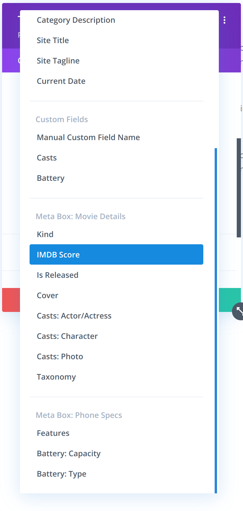
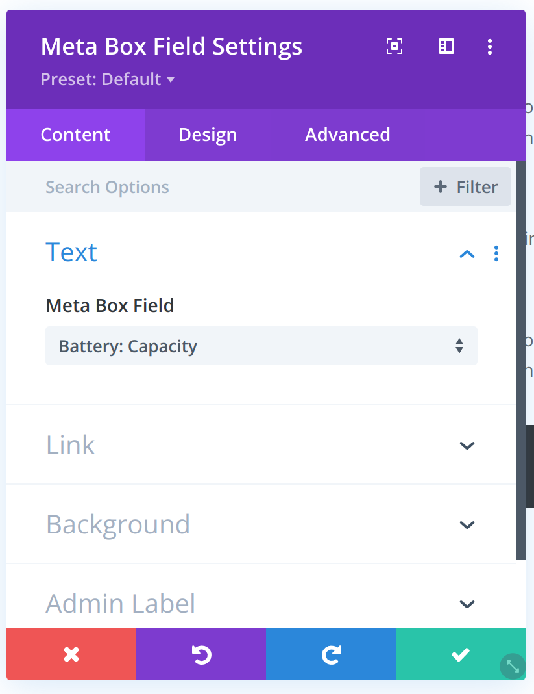
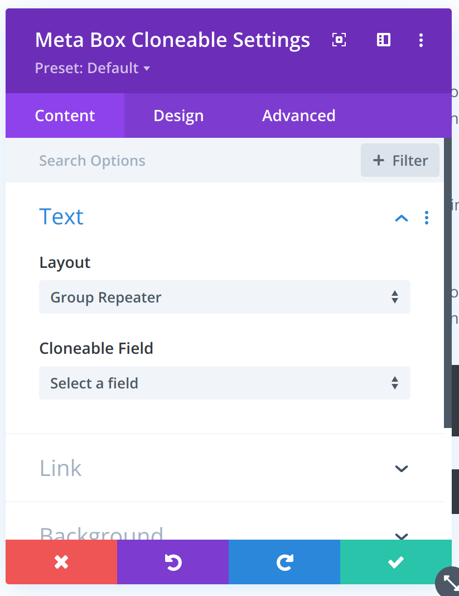
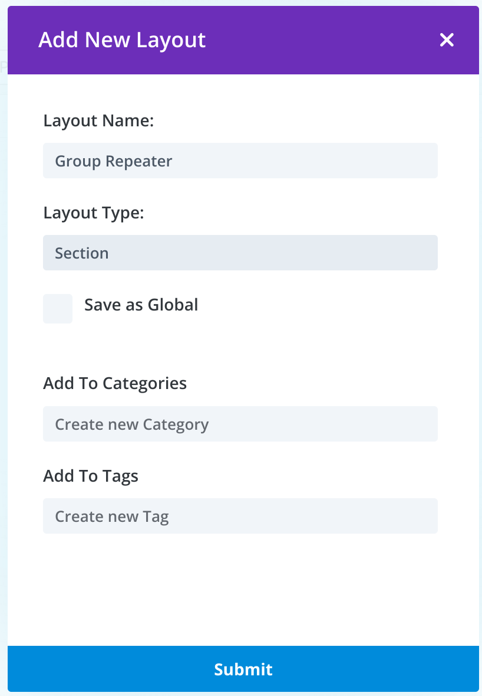
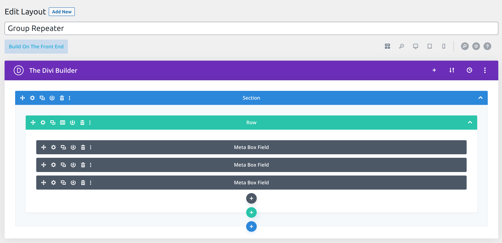
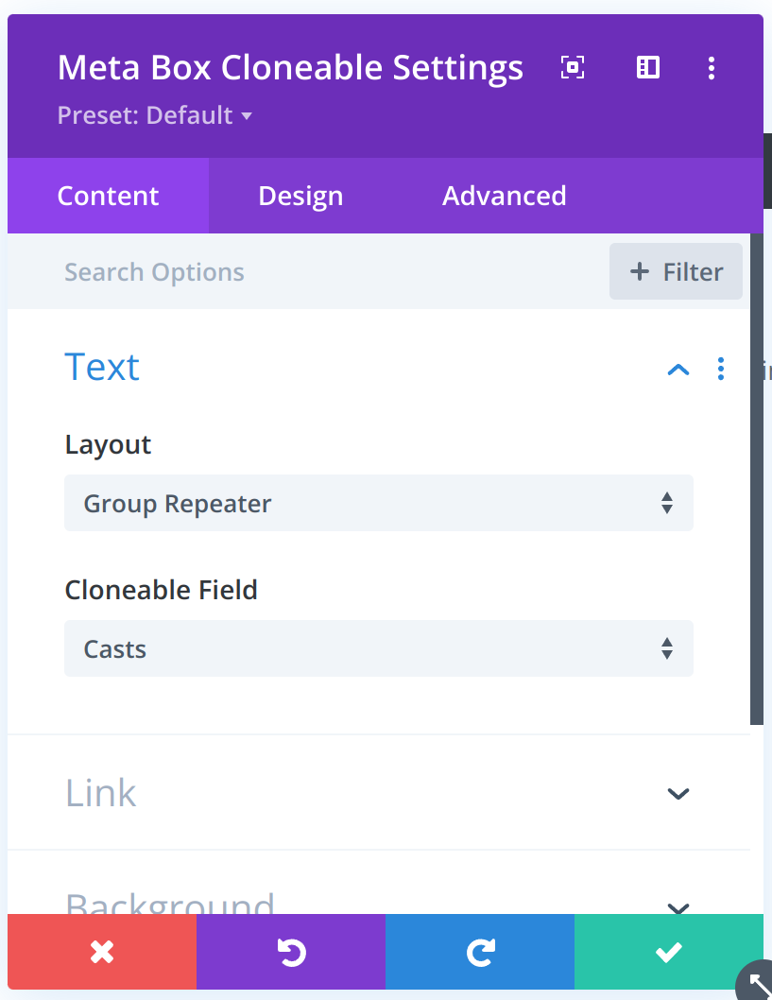

# MB Divi Integration
Meta Box Divi Builder Integration

## Installation
You need to install [Meta Box](https://wordpress.org/plugins/meta-box/) plugin first

Then install MB Divi Integration extension

## Usage
This extension does two things:
- Adds new Dynamic Content source from Meta Box fields.
- Adds two new modules for Divi Builder: Meta Box Cloneable and Meta Box Field.

### Using Dynamic Content
In addition to default dynamic content sources, you'll see a new source called "Meta Box". This source allows you to get data from Meta Box fields.

To add dynamic content, add new module that supports dynamic content (e.g. Text module), click on the dynamic content icon and choose "Meta Box" source. Then choose the field you want to get data from.




Read more about [Dynamic Content](https://www.elegantthemes.com/documentation/divi/dynamic-content/).

### Using Meta Box Field module
Meta Box Field module is allows you to get data from a Meta Box field, same as the dynamic content above. The difference is that you can pick the field directly in the module settings, instead of going through the dynamic content popup.

To use this module:
- Add new module to the page.
- Choose "Meta Box Field" module.
- Choose the field you want to get data from.



### Using Meta Box Cloneable module
Meta Box Cloneable module allows you to get data from any fields that supports cloneable, for example Group field. Any fields inside the cloneable field will be repeated for each clone and display exactly the position value. This module is useful when you want to display a list of data, such as list of team members, list of services, etc.

Meta Box Cloneable module needs two parameters:
- `Layout`: the layout for the cloneable field. This layout will be repeated for each clone.
- `Cloneable Field`: The field that hold the actual data. This field must be a cloneable field.



To use this module:

#### 1. Create layout for the cloneable field
- Go to `Divi\Divi Library` and click `Add New` to create a layout for the cloneable field. This layout will be repeated for each clone.
- An `Add New Layout` popup will appear, enter desired the layout name, and select `Layout Type`, for example, if you want the repeater displays as a section, select `Section` as the layout type.
- Click `Submit` to create the layout.

- Add `Meta Box Field` module that you want to repeat into the layout. This module will be repeated for each clone. For example, if you want to repeat children of group field, you can add children fields of the group field, if you want to repeat other fields like text, image, etc, you can add those fields directly.


#### 2. Add Meta Box Cloneable module to the page
- Add new module to the page.
- Choose "Meta Box Cloneable" module.
- Choose the layout you created in step 1.
- Choose the cloneable field that you want to repeat.


## Development

### Project structure
```
.
├── src # Main plugin folder
│   ├── Templates # Templates for displaying meta box fields
│   ├── Extension.php # Register divi modules
│   ├── FieldQuery.php # Helpers class for querying from mb registry
│   ├── Main.php # Bootstrap plugin
│   ├── Output.php # Output meta box fields data
├── scripts # divi-scripts built scripts
├── styles # divi-scripts built styles
├── includes # Divi module files, this folder is created by `divi-scripts`
├── images # Images for README.md
```

### Divi Modules
Divi uses React to build the UI. It setups it own scripts `divi-scripts` same as `create-react-app` and uses `webpack` to build the scripts.

Requirements:
- Node.js 14.x *(higher version doesn't works!!!)*

The recommended way to build the scripts is using `nvm` or `fnm` to install Node.js 14.x and use `npm` to build the scripts.

```bash
npm install
npm run build # build scripts
# or
npm run start # watch scripts
```

